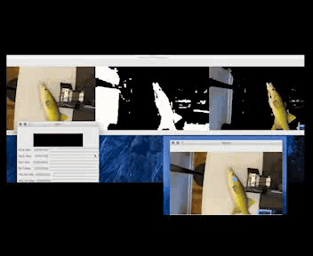

# How To Kill A Fish
 
Source code for one of the projects described in Design for Ethical Fishing. HTKAF is a robotic ikejime tool that allows fishermen to slaughter fish painlessly.

[Informational Video](https://drive.google.com/file/d/1XWHXH9ygHLdgQ2DVScSIFX1xP1ImnFDS/view?usp=sharing).

## Prerequisites:

Before you begin, ensure you have met the following requirements:
* You have installed the latest versions of Python (this was built on Python 3.8), of OpenCV-Python, and of PySerial. 
* Any functioning OS that can run all of the above.
* An open-source 3D printer or misc. gantry system (for which you will need to adjust the values).
* A functioning, moderate quality color camera.
* You have read this guide.

## Execution:

1. Set up hardware as described in the paper. Obtain your hardware specifications e.g. baud rate. 
2. Run match_colors_get.py to obtain HSV values, adjusting input webcam or video for your setup. Test this with color_detection_test.py and adjust points as required.
3. Adjust color_stab.py for the vertical heights and horizontal widths of your gantry's dimensions. The video input and other specifications in setup should also be working, so you should test a sequence for your setup before putting live fish in.
4. Run color_stab.py with a stunned fish and kill the fish. Enjoy the high quality meat!

## Contributing to HTKAF:
<!--- If your README is long or you have some specific process or steps you want contributors to follow, consider creating a separate CONTRIBUTING.md file--->
To contribute to HTKAF, follow these steps:

1. Fork this repository.
2. Create a branch: `git checkout -b <branch_name>`.
3. Make your changes and commit them: `git commit -m '<commit_message>'`
4. Push to the original branch: `git push origin howtokillafish/<location>`
5. Create the pull request.

Alternatively see the GitHub documentation on [creating a pull request](https://help.github.com/en/github/collaborating-with-issues-and-pull-requests/creating-a-pull-request).

## Contributors:

Thanks to the following people who have contributed to this project:

* [@safekhawaja](https://github.com/safekhawaja) 📖🐛
* [@liningyao](https://morphingmatter.cs.cmu.edu) 🐛

## Contact:

If you want to contact me you can reach me at <saifnk@wharton.upenn.edu>.

## License
<!--- If you're not sure which open license to use see https://choosealicense.com/--->

This project uses the following license: [GNU GPLv3](<https://choosealicense.com/licenses/gpl-3.0/>).
